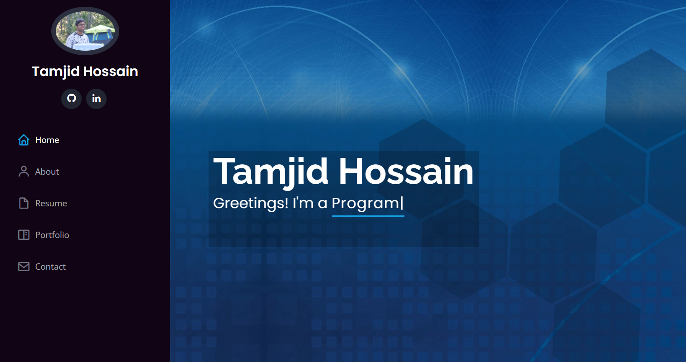

# Portfolio
This is my portfolio to showcase my Full Stack Projects and give you a chance to learn more about me. This taught me about building a site from scratch using HTML and CSS as in the past I've relied on templates.

## Getting Started
Checkout the site at https://thossain30.github.io/webportfolio/

# Usage
### Here is a short preview of the website!

## License
This Project is licensed under the MIT License - see the [LICENSE.md](LICENSE.md) file for details.
